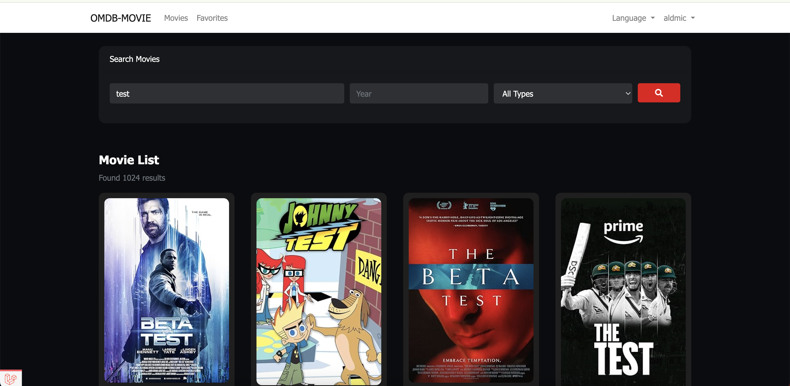
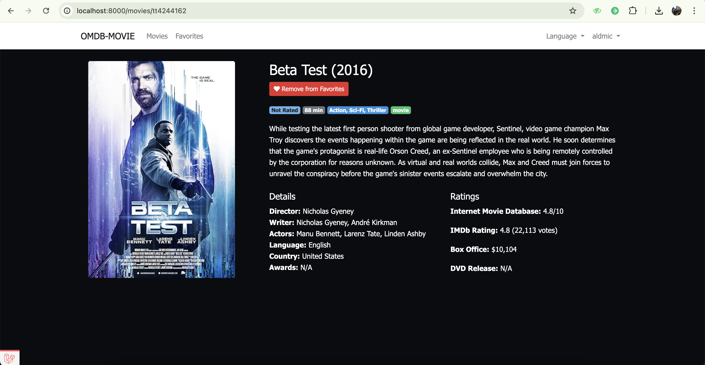
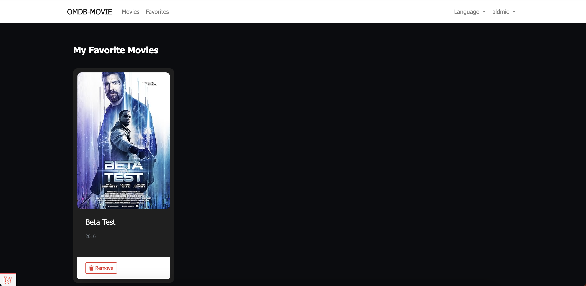

# Movie Application with OMDb API

This is a Laravel 5.8 application that allows users to search for movies using the OMDb API, view movie details, and manage a list of favorite movies.

## Features

-   User authentication (Login required to access movie features)
-   Movie search with multiple parameters (title, year, type)
-   Infinite scroll for movie listings
-   Lazy loading of movie posters
-   Multi-language support (English/Indonesian)
-   Favorite movie management
-   Responsive design

## Libraries Used

-   Laravel Collective (For form helpers)
-   GuzzleHTTP (For API requests)
-   LazyLoad (For lazy loading images)
-   Font Awesome (For icons)
-   jQuery (For AJAX and DOM manipulation)
-   Bootstrap (For responsive layout)

## Architecture

The application follows the MVC (Model-View-Controller) architecture:

-   **Models**:

    -   `User` (Built-in Laravel)
    -   `Favorite` (Custom model for storing user favorites)

-   **Controllers**:

    -   `MovieController` (Handles movie search and details)
    -   `FavoriteController` (Manages favorite movies)
    -   `HomeController` (Redirects to movie list)
    -   `LanguageController` (Handles language switching)

-   **Views**:

    -   Blade templates with partials for reusable components
    -   Responsive design with Bootstrap
    -   Lazy loading for images

-   **Services**:
    -   `OmdbService` (Handles all OMDb API interactions)

## Screenshots

-   Login Page
    
-   Movie List Page
    
-   Movie Detail Page
    
-   Favorite Page
    

## Installation

1. Clone the repository
2. Run `composer install`
3. Create a `.env` file and configure database settings
4. Add your OMDb API key to `.env`:
   OMDB_API_KEY=your_api_key
   OMDB_API_URL=http://www.omdbapi.com/
5. Run migrations and seeders:
   php artisan migrate
   php artisan db:seed --class=UsersTableSeeder
6. Serve the application: php artisan serve

## Default Credentials

-   Username: aldmic
-   Password: 123abc123
